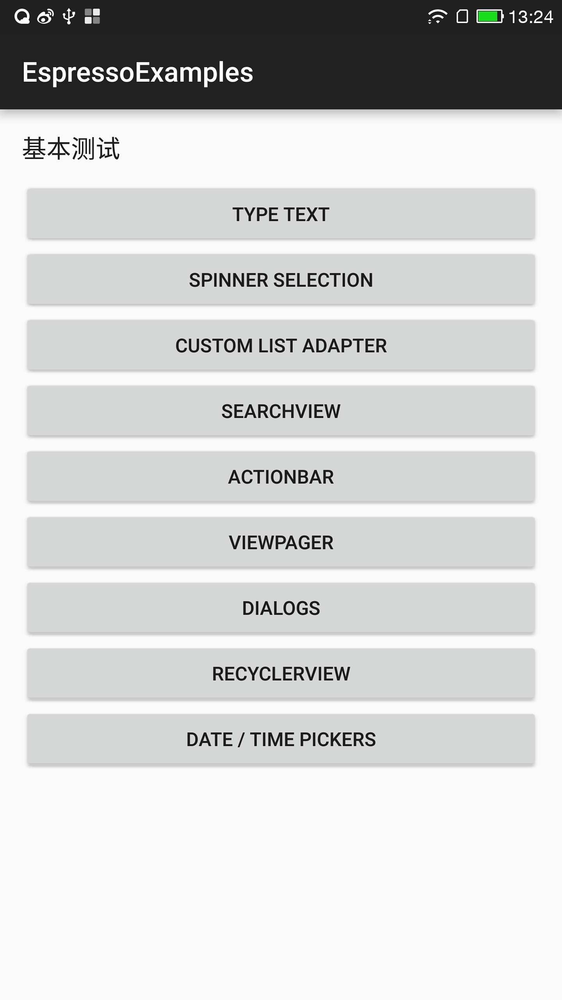

# EspressoExamples
示例的基本示意图


[toc]

上一篇说道如何在AndroidStudio中配置Espresso，本篇主要介绍使用Espresso时的思考和示例(示例已托管在github)；

## 关于Espresso的一些杂谈

Espresso被习惯的成为浓缩咖啡，据说原发明国是意大利。不知道为啥Google要将这么有灵魂的测试框架取名叫浓缩咖啡，"浓缩的就是精华"？:)。
##本文愿景

  愿你沉醉在单元测试中日渐消瘦，无法自拔~
  愿你写完单元测试归来时，仍是少年。

##对Espresso的基本印象

其实在Android 测试支持库中就已经包括如下的一些自动化测试工具：

- **AndroidJUnitRunner**：适用于 Android 且与 JUnit 4 兼容的测试运行器
- **Espresso**：UI 测试框架；适合应用中的功能性 UI 测试
- **UI Automator**：UI 测试框架；适合跨系统和已安装应用的跨应用功能性 UI 测试

*Espresso 测试框架提供了一组 API 来构建 UI 测试，用于测试应用中的用户流。利用这些 API，可以编写简洁、运行可靠的自动化 UI 测试。*


## Espresso 测试框架的主要功能

#### 视图匹配

#### 操作 API

#### UI 线程同步

---
系好安全带，开车了

####单一特性查找控件

现在有这么一个情况，代码刚写完，迫不及待的想检查一下里边的控件(视图)表现是否得体。

怎么能设计一个套路，来检测一下？

首先，得找到你要的控件(视图)。
那么问题来了，茫茫人海，一叶扁舟，怎么才能找到想要的控件(视图）？

俗话说：“\*\*\*\*\*,捉贼拿脏”，先找一下控件的特征:)

- onView(withId(R.id. jack))  【在知道控件id的情况下】

- onView(withText("Jack"))【有文本"Jack"这几个字的文本控件】

- onView(withTagKey("full_name"));【根据setTag(key,value)来查找】 

- onView(withTagValue("Jack_Dawson"))；【Jack的全名叫杰克.道森，tag的值】

- onView(withHint("提示词")); 【忘词了，居然有提示词 eg.EditText】

  ….

and  so on 可以根据指定的特征来对控件进行筛选查找【如图】

没有什么问题是一张图解决不了的，要是有的话，那就两张:)
- 附图

  


####多个特性查找控件
但是，有时候我们会遇到这种情况：

多个页面中控件的id是一样的，这个时候就要需要根据多个特性来筛选了。

毫无疑问，一个惊天地、泣鬼神的API就要出世了。不错，它就是智慧与美貌并存，正义与侠义的化身的 **allof()**

在**Matchers**类下边有一个方法**allOf()**，参数是一个可变参数。我的个乖乖，这样就可以根据多个特性来筛选了；

具体示例如下:

```java
onView(allOf(withId(R.id.jack),withText("Jack")));[注：可变参数可以传递多个参数]
一个ID叫jack,并且显示了“Jack”文字的控件，当然可以加很多限制条件，只有你有都可以传递在allOf的可变参数中
```


至此，顺藤摸瓜，根据蛛丝马迹在Espresso中锁定一个控件不在是难事了:)

---

东风已借，完事具备，开测了、开测了!

show me the code!

###### 测RecyclerView引发的血案

```java
public class RecyclerViewTest extends ActivityInstrumentationTestCase2<RecyclerViewActivity> {

    private static final String BOOK_TITLE = "Clean Code";
    private static final String BOOK_AUTHOR = "Robert C. Martin";

    public RecyclerViewTest() {
        super(RecyclerViewActivity.class);
    }

    @Override
    protected void setUp() throws Exception {
        super.setUp();
        getActivity();//设置运行上下文
    }
   
    //RecyclerViewActions为Espresso的提供API
    /**
     * 根据Item的position来进行测试
     */
    public void testClickAtPosition() {        
   onView(withId(R.id.recyclerView)).perform(RecyclerViewActions.actionOnItemAtPosition(0,  click()));//点击RecyclerView的第一个条目
        onView(withId(R.id.book_title)).check(matches(withText(BOOK_TITLE)));//检查控件文本内容是否和BOOK_TITLE内容一致
        onView(withId(R.id.book_author)).check(matches(withText(BOOK_AUTHOR)));//同上
    }

    public void testClickOnViewInRow() {
        //点击一个有具体描述的文本
        onView(withId(R.id.recyclerView)).perform(RecyclerViewActions.actionOnItem(
                hasDescendant(withText(BOOK_TITLE)), click()));//
        onView(withId(R.id.book_title)).check(matches(withText(BOOK_TITLE)));
    }
}
```

```java
附：
1.RecyclerViewActivity
public class RecyclerViewActivity extends AppCompatActivity {

    @Override
    protected void onCreate(Bundle savedInstanceState) {
        super.onCreate(savedInstanceState);
        setContentView(R.layout.activity_recycler_view);
        RecyclerView recyclerView = (RecyclerView) findViewById(R.id.recyclerView);
        recyclerView.setLayoutManager(new LinearLayoutManager(this));
        recyclerView.setAdapter(new RecyclerBooksAdapter(this));
    }
}

2.item_book.xml
<?xml version="1.0" encoding="utf-8"?>
<RelativeLayout xmlns:android="http://schemas.android.com/apk/res/android"
    xmlns:tools="http://schemas.android.com/tools"
    android:orientation="vertical"
    android:layout_width="match_parent"
    android:layout_height="match_parent"
    android:padding="12dp">

    <ImageView
        android:id="@+id/icon"
        android:src="@drawable/book"
        android:layout_width="40dp"
        android:layout_height="40dp"
        android:layout_marginRight="8dp" />

    <TextView
        android:id="@+id/book_title"
        android:layout_toRightOf="@id/icon"
        android:layout_toEndOf="@id/icon"
        android:layout_width="fill_parent"
        android:layout_height="wrap_content"
        android:textSize="16sp"
        tools:text="Some Cool Book" />

    <TextView
        android:id="@+id/book_author"
        android:layout_below="@id/book_title"
        android:layout_toRightOf="@id/icon"
        android:layout_toEndOf="@id/icon"
        android:layout_width="fill_parent"
        android:layout_height="wrap_content"
        android:textSize="12sp"
        tools:text="by Awesome Author" />

</RelativeLayout>
```

由一句话引发的思考
```java
onView(withId(R.id.recyclerView)).perform(RecyclerViewActions.actionOnItemAtPosition(0,  click()));
```

######关于perform()函数的二三事：
到底这神乎其技的perform()函数凭借什么超能力来拯救世界的？
在上文中锁定要测试的控件之后，"该配合演出的控件就要尽情表演了",作为编剧应该给演员一个剧本吧。

冥冥中早有安排，一切的剧情都可以放在perform函数的传参（可变参数）中，来制造一系列的矛盾。perform()函数就只干了一件事：就是编写剧本(View的动作轨迹)。

perform()的动作(Action|ViewAction)

ViewAction中都有哪些动作呢？

- ```
  clearText()清空文本
  ```

- ```
  click()点击动作
  ```

- ```java
  swipe系列 [猛击，这个厉害了]
  swipeLeft()       原版解释:swipe right-to-left across the vertical center of the view
  swipeRight()	  原版解释:swipe left-to-right across the vertical center of the view
  swipeDown()       原版解释:       top-to-bottom
  swipeUp()		  原版解释:       bottom-to-top 
  ```

- ```
  closeSoftKeyboard() 这个不用多说了吧，关闭软键盘
  ```

- ```
  pressBack() 相当于点击了返回键了
  ```

- ```
  pressKey(keyCode)  还可以根据keycode来点击按键
  ```

- ```
  doubleClick() 双击
  ```

- ```
  longClick()
  ```

等一系列操作，限于篇幅就不在过多的展开了，想看详细的可以直接去ViewAction类下边去看，只有你想不到的没有你看不到的~

后话：其他的Action多多少少和ViewAction有一些说不清道不明的关系，相当之暧昧，比如：RecyclerViewActions、EditorAction、CloseKeyboardAction、ScrollToAction等，有兴趣的可以看一下它们的实现.


######check()函数的二三事

演员演完了，这时候作为Director(导演)就得看一下演员演的是否到位。
关键是否达到了预期的效果，如果你要加点潜规则啥的都看你自己了:)

来定义一点规则吧，不然演员就瞎演了。

- check函数的传参ViewAssertion（Checks the state of the given view (if such a view is present).）【大佬们的命名真腻害，这不就是对这个控件的断言吗？】

那么问题来了，check到底能检查一些什么信息？且听我细细道来。

先举个简单的例子吧：

```
onView(withId(R.id.jack)).check(matches(isDisplayed()));//检查控件是否显示了
onView(withId(R.id.jack)).check(matches(not(isDisplayed()));//not
onView(withId(R.id.jack)).check(matches(withHint("Jack")));//检查提示词是否正确
onView(withId(R.id.jack)).check(matches(withText("Jack")));//检查文本
```

当然还有很多可以检测的类型，例如isEnabled()、isFocusable()、hasFocus()等等

所有的可检测的类型都在ViewMatchers类里边了，想了解的少年可以去瞅瞅


######【附】

- 博客传送门

​      http://www.jianshu.com/p/0a6b5ac15bc7 博客地址
